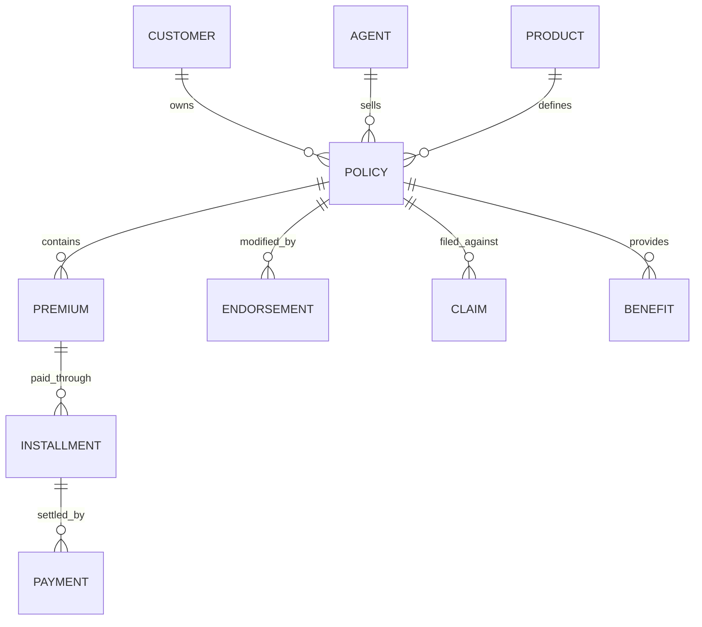
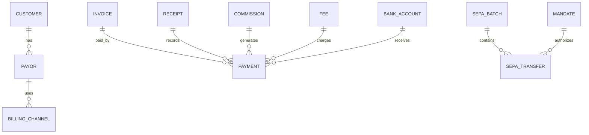
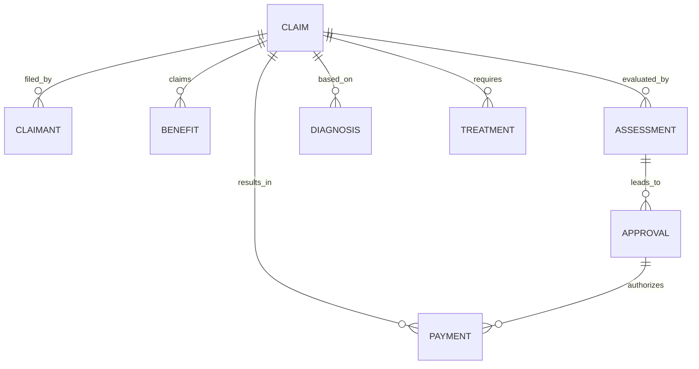
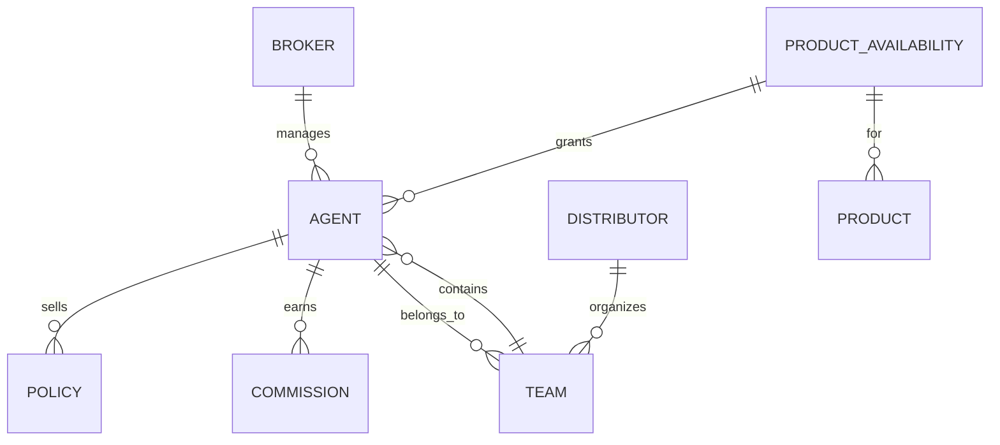
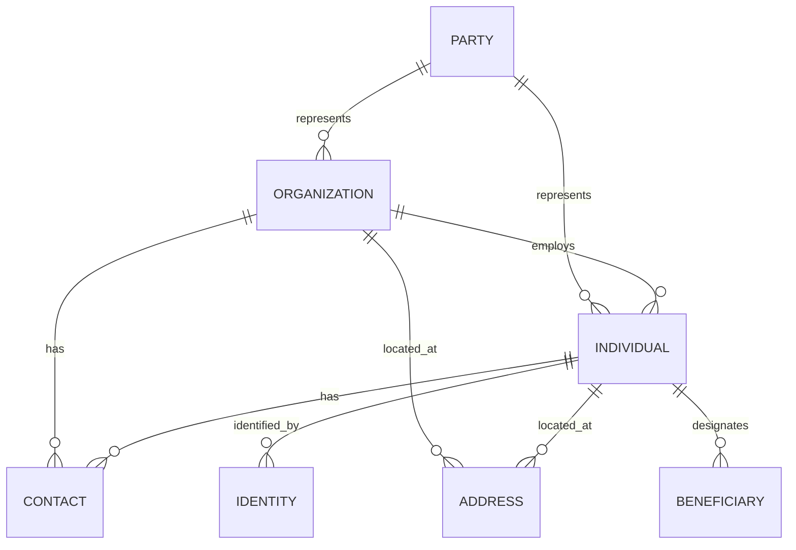
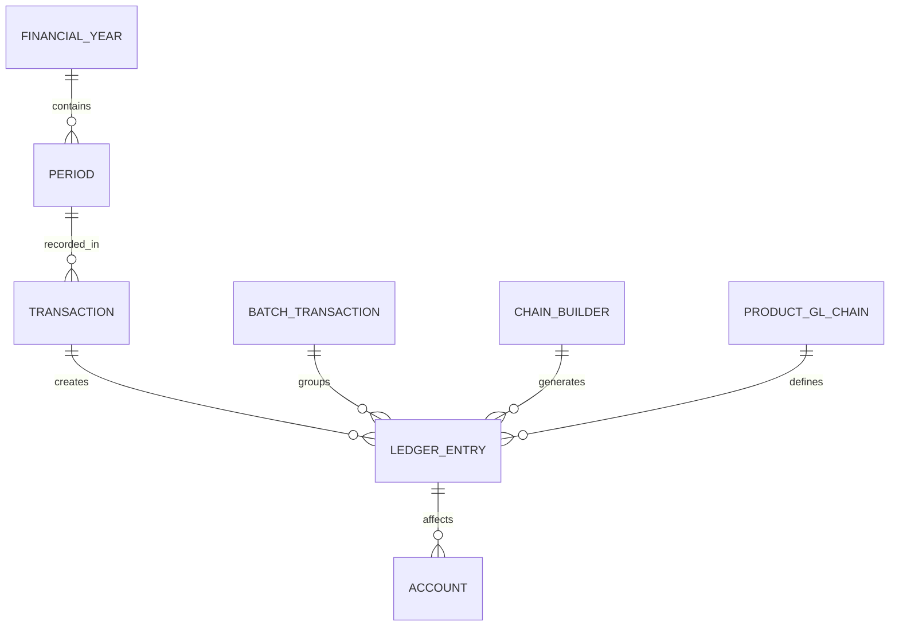
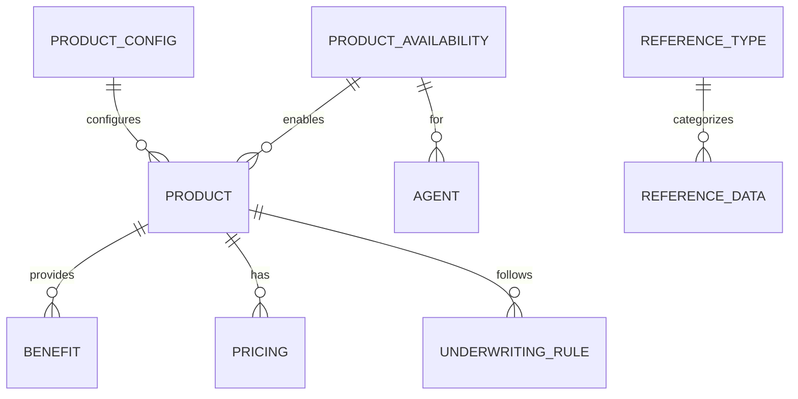
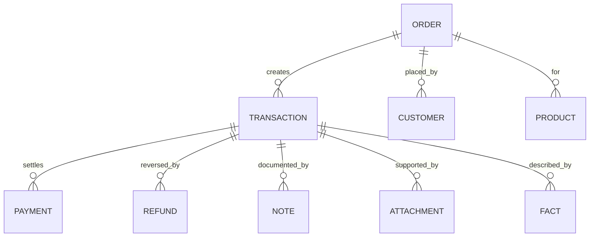
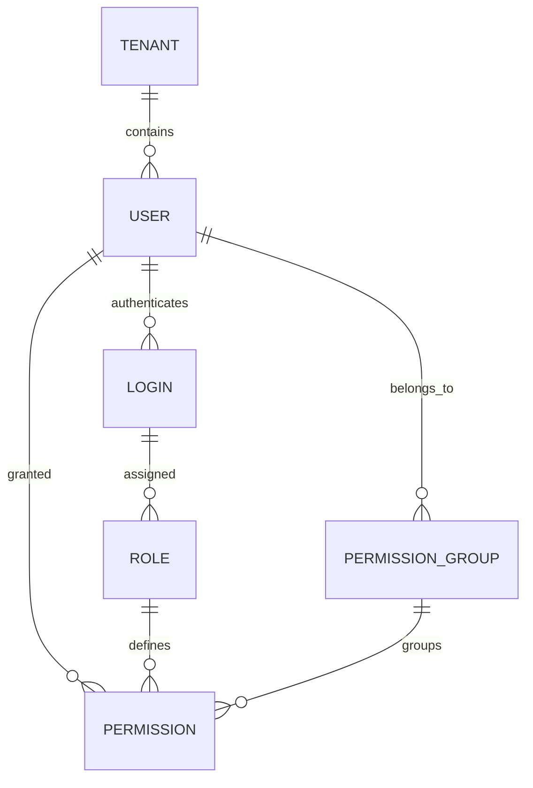

# GraphQL Schema Reference

This page provides reference information about the CoverGo GraphQL schema structure.

## GraphQL Endpoint

```
https://api.dev.covergo.cloud/graphql/
```

## Schema Structure

The GraphQL schema was analyzed using introspection queries. The schema contains:

### Query Type
The schema supports query operations for data retrieval, including:
- Financial data queries
- Policy information
- Billing data
- Commission data
- And other business data

### Mutation Type
The schema provides extensive mutation operations for business operations.

## Authentication APIs

!!! success "Authentication APIs Available"
    The schema includes several authentication and token management operations:

    **Query Operations:**
    - `refreshToken` - Refresh authentication tokens
    - `token_2` - Alternative token refresh endpoint
    - `verifyGOODTokenAndGetCoverGoToken` - Token verification
    - SSO token queries for single sign-on authentication

    **Mutation Operations:**
    - `createAccessTokenFromOtpLogin` - Generate access tokens using OTP
    - `generateKycAuthToken` - Create KYC authentication tokens
    - `initializeTenantAuth` - Initialize tenant authentication

    See the [Authentication](../authentication/token.md) section for detailed usage.

## Entity Relationship Diagrams

The following diagrams show the relationships between core business entities in the CoverGo system. Each diagram represents a major domain area and shows how entities relate to each other.

### Policy & Premium Domain



### Billing & Payment Domain



### Claims Domain



### Agent & Broker Domain



### Customer & Party Domain



### Financial Domain



### Product & Reference Domain



### Transaction & Order Domain



### Authentication & Security Domain



## Schema Introspection

The schema was introspected using the following query:

```graphql
query {
  __schema {
    mutationType {
      fields {
        name
        description
        args {
          name
          description
          type {
            name
            kind
            ofType {
              name
              kind
            }
          }
        }
        type {
          name
          kind
          ofType {
            name
            kind
            fields {
              name
              type {
                name
                kind
              }
            }
          }
        }
      }
    }
  }
}
```

## Response Structure

All mutations return a standardized result structure:

```json
{
  "data": {
    "mutationName": {
      "status": "string",
      "errors": [...],
      "errors_2": [...],
      "value": "...",
      "isSuccess": true|false
    }
  }
}
```

## Error Handling

The API uses a consistent error handling pattern with:
- `status`: Operation status message
- `errors`: Primary error array
- `errors_2`: Secondary error array
- `isSuccess`: Boolean success indicator

## See Also

- [Available Mutations](mutations.md) - Complete list of mutation operations
- [Authentication](../authentication/token.md) - Authentication information
