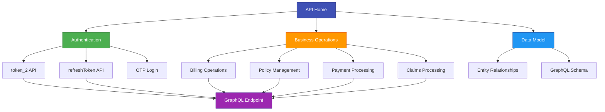

# Welcome to CoverGo API Documentation

This is the official documentation for the CoverGo GraphQL APIs, providing comprehensive coverage of insurance and financial services.

## Documentation Overview

This documentation site contains technical documentation covering all aspects of the CoverGo API system, including authentication, business operations, and data relationships.

### Documentation Sections

| Section | Description | Key Topics |
|---------|-------------|------------|
| **Getting Started** | Quick start guide | Prerequisites, authentication, first API calls |
| **Authentication** | Token management | `token_2`, `refreshToken` APIs, OTP login |
| **API Reference** | Complete API docs | Mutations, queries, entity relationships |
| **Schema** | GraphQL structure | Types, relationships, introspection |

## API Structure Overview

The following diagram illustrates the main components and relationships in the CoverGo API ecosystem:



## GraphQL Endpoint

```
https://api.dev.covergo.cloud/graphql/
```

## Core Features

### 🔐 **Authentication**
- **token_2**: Direct token refresh with username/password
- **refreshToken**: Exchange refresh token for new access token
- **OTP Login**: Secure authentication via one-time passwords

### 💼 **Business Operations**
- **Policy Management**: Premium registration, adjustments, cancellations
- **Billing**: Channel management, payor operations, fee handling
- **Payments**: Invoice generation, payment processing, SEPA transfers
- **Claims**: Claim registration, processing, and settlements

### 📊 **Data Model**
- **Entity Relationships**: 9 domain-specific ER diagrams
- **GraphQL Schema**: Complete type definitions and relationships
- **Mutation Reference**: 50+ business operation mutations

## Quick Navigation

### By API Type

| API Type | Description | Primary Use Cases |
|----------|-------------|-------------------|
| **Queries** | Data retrieval | Token refresh, schema introspection |
| **Mutations** | Data modification | Policy creation, payment processing, billing |

### By Business Domain

| Domain | Key Operations | Related APIs |
|--------|----------------|--------------|
| **Authentication** | Token management | `token_2`, `refreshToken` |
| **Policy** | Insurance policies | Premium registration, adjustments |
| **Billing** | Payment processing | Fee management, invoice generation |
| **Claims** | Insurance claims | Claim processing, settlements |

## Getting Started

### For New Users
1. Review [Getting Started](getting-started.md) for prerequisites
2. Learn about [Authentication](authentication/token.md) flow
3. Explore [API Reference](api-reference/schema.md) structure

### For Developers
1. Check [Entity Relationships](api-reference/schema.md) for data model
2. Review [Available Mutations](api-reference/mutations.md)
3. Study authentication patterns

## Features Demonstrated

This documentation showcases:

- ✅ **Mermaid Diagrams**: Entity relationships and system architecture
- ✅ **Interactive Tables**: API reference and configuration data
- ✅ **Material Theme**: Modern design with dark/light mode toggle
- ✅ **GitHub Integration**: Repository links and automated deployment
- ✅ **Code Highlighting**: Syntax highlighting for GraphQL and JSON

## Next Steps

1. **Start Here**: Begin with [Getting Started](getting-started.md)
2. **Authentication**: Learn about [token APIs](authentication/token.md)
3. **API Reference**: Explore [entity relationships](api-reference/schema.md)
4. **Business Operations**: Review [available mutations](api-reference/mutations.md)

---

*Built with MkDocs Material • [View on GitHub](https://github.com/godhavarigopalai-cpu/covergo-api-docs)*
